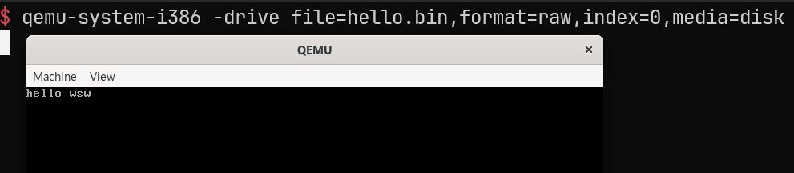
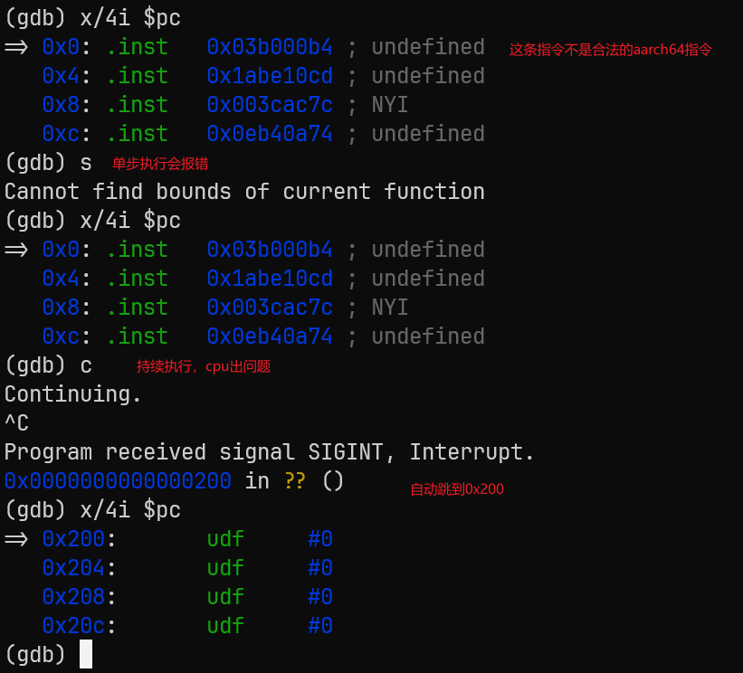

# linux世界的兼容性

> TODO: (重写)多数内容由deepseek生成，行文上可能有割裂感，因为是不同地方摘抄过来的

兼容性区分**源码级兼容性**（即代码拷贝到其他平台的编译器下能否编译通过）和**二进制兼容性**（代码编译生成的二进制拷贝到其他平台下能否正常工作）。
Linux兼容posix标准，而在二进制层面由不同层级的标准来保证。这里简单做介绍

## 源码兼容性

[posix.1](./posix.1/index)

## 二进制兼容性

###  六层递进兼容性表

> 表格由deepseek生成，是我很久以前就有的一个想法，最近才算整理清楚

| 兼容性标准 / 规范                                     | ① 裸机器码 | ② ELF格式 | ③ 可加载ELF | ④ 可执行ELF<br>（系统调用） | ⑤ 动态链接ELF<br>（libc依赖） | ⑥ 跨发行版<br>（部署） |
| :---------------------------------------------------- | :--------: | :-------: | :---------: | :-------------------------: | :---------------------------: | :--------------------: |
| **psABI**（CPU指令编码、寄存器约定）                  |     ✅      |     ✅     |      ✅      |              ✅              |               ✅               |           ✅            |
| **gABI**（ELF文件格式、段布局）                       |     ❌      |     ✅     |      ✅      |              ✅              |               ✅               |           ✅            |
| **ELF OS识别**（`EI_OSABI`标签匹配）                  |     ❌      |     ❌     |      ✅      |              ✅              |               ✅               |           ✅            |
| **OS ABI**（系统调用号、调用约定）                    |     ❌      |     ❌     |      ❌      |              ✅              |               ✅               |           ✅            |
| **标准库实现ABI**（`glibc`/`musl`类型布局、符号版本） |     ❌      |     ❌     |      ❌      |              ❌              |               ✅               |           ✅            |
| **FHS + 发行版路径**（链接器/库目录布局）             |     ❌      |     ❌     |      ❌      |              ❌              |               ❌               |           ✅            |


### `gABI` /` psABI` / `OS ABI`定义与常见规范

这三个概念共同构成了现代操作系统二进制接口（ABI，Application Binary Interface）的基石，决定了编译好的程序如何在特定平台上运行。

#### 一、gABI（Generic ABI，通用应用程序二进制接口）

定义：
gABI 是 ABI 体系中的通用核心层，定义了所有处理器架构都必须遵守的与 CPU 无关的规则。它相当于整个二进制接口的宪法。

核心内容：
gABI 最核心的贡献是定义了 ELF（Executable and Linkable Format，可执行与可链接格式）文件格式规范。这包括 ELF 文件头、程序头表、节头表的结构，以及静态链接、动态链接、符号表、重定位等基础机制的统一约定。

常见规范名称：
System V ABI（System V 应用程序二进制接口）。这是最权威的 gABI 规范，几乎所有 Unix 和 Linux 系统都以此为基础。
在线版本参考地址：

- [sco-gabi](https://www.sco.com/developers/gabi/)
- [linux-elf](https://refspecs.linuxbase.org/elf/index.html)

#### 二、psABI（Processor-Specific ABI，处理器补充 ABI）

**定义：**
psABI 是 gABI 的架构补充层，专门为某个具体的 CPU 架构（如 x86-64、ARM、RISC-V）补充与机器硬件直接相关的细节规则。它是 gABI 在特定处理器上的具体实现说明。

**核心内容：**
psABI 为特定架构定义了如下内容：

- **函数调用约定：**参数如何传递（通过寄存器还是栈）、返回值如何存放、谁负责清理栈帧。
- **寄存器使用规则：**哪些寄存器是调用者保存的，哪些是被调用者保存的。
- **系统调用约定：**如何发起系统调用（使用什么指令，参数放在哪个寄存器）。
- **数据表示：**基本数据类型（如 int、long、指针）的大小、对齐方式、字节序（大端/小端）。
- **栈帧布局：**栈的生长方向、栈帧结构。
- 处理器特定的 ELF 补充：如重定位类型、特殊段定义。

常见规范名称：

- x86-64 psABI：用于 64 位 x86 架构（即 AMD64 / Intel 64）。
  文档地址：[x86-64-ABI](https://gitlab.com/x86-psABIs/x86-64-ABI)
- i386 psABI：用于 32 位 x86 架构。
- ARM 架构的 AAPCS（ARM Architecture Procedure Call Standard）及其 ABI 补充。
  文档地址：[abi-aa](https://github.com/ARM-software/abi-aa)
- RISC-V psABI：由 RISC-V 国际基金会维护。
  文档地址：[riscv-elf-psabi](https://github.com/riscv-non-isa/riscv-elf-psabi-doc)

#### 三、OS ABI—— 静态标识层 （ELF 中的 OS ABI标记）

定义：
OS ABI 标识了该 ELF 文件所针对的目标操作系统，以及该文件是否使用了操作系统特定的 ELF 扩展。它不是一个独立的大部头规范，而是通过 ELF 文件头中的一个单字节字段（`e_ident[EI_OSABI]`）来承载的标识符。

核心内容：
这个字段告诉内核或动态链接器两件事：

- 该可执行文件或共享库预期运行在哪个操作系统上。
- 文件中可能使用了特定于该操作系统的 ELF 扩展（如 GNU 扩展的哈希表 `DT_GNU_HASH`），因此在解释某些 ELF 结构时应当参考该操作系统的规则，而非盲目套用通用 gABI。

这个字段是实现跨操作系统二进制兼容性的重要门槛。

常见取值（`e_ident[EI_OSABI]` 的值）：

- `ELFOSABI_NONE`（值为 0）：表示遵循标准的 gABI / psABI，无特定操作系统扩展。这是最通用的取值。
- `ELFOSABI_LINUX`（值为 3）：表示该 ELF 文件针对 Linux 操作系统，可能使用了 Linux 特有的 ELF 扩展。
- `ELFOSABI_FREEBSD`（值为 9）：针对 FreeBSD 操作系统。
- `ELFOSABI_NETBSD`（值为 2）：针对 NetBSD 操作系统。
- `ELFOSABI_SOLARIS`（值为 6）：针对 Sun Solaris / Oracle Solaris 操作系统。
- `ELFOSABI_HPUX`（值为 1）：针对 HP-UX。
- `ELFOSABI_AIX`（值为 10）：针对 AIX。
- `ELFOSABI_GNU`（值为 0x4353，即字符 'CS' 的数值）：这是一个特殊情况，用于 GNU/Hurd 系统。

`ELFOSABI_*` 的完整取值列表可以在标准的 `elf.h` 头文件中找到，也可以参考 Linux 内核源码的 `include/uapi/linux/elf-em.h` 文件。

#### 四、OS ABI—— 运行时接口层（系统调用与内核 ABI）

**定义**：
OS ABI 的运行时接口层，定义了用户态程序如何向操作系统内核请求服务，即 **系统调用（System Call）接口**。这包括系统调用号、调用约定、参数传递方式、返回值语义等。这一层是操作系统真正区分“你是谁”的核心边界。

**核心内容**：
运行时接口层定义了以下几个关键方面：

1. **系统调用号（System Call Numbers）**
   - 每个系统调用（如 `read`、`write`、`open`、`exit`）在特定操作系统上被分配一个唯一的整数编号。
   - 用户态程序将系统调用号放入特定寄存器（如 x86-64 Linux 的 `rax`）后，执行陷入指令（如 `syscall`）进入内核。
   - 不同操作系统的系统调用号分配方案完全不同。例如：
     - Linux x86-64 中 `write` 的系统调用号是 `1`，`exit` 是 `60`。
     - FreeBSD x86-64 中 `write` 的系统调用号是 `4`，`exit` 是 `1`。
   - 如果程序使用 Linux 的系统调用号在 FreeBSD 内核上执行，内核会执行错误的系统调用或直接报错。
2. **系统调用约定（Calling Convention）**
   - 参数如何传递给内核：通过哪些寄存器传递，顺序如何，以及参数个数超出寄存器容量时如何处理（如使用栈）。
   - 返回值如何返回：通过哪个寄存器返回结果，以及错误码如何表示（如 Linux 通过 `rax` 返回，负值表示错误）。
   - 示例（Linux x86-64 的 `write` 系统调用）：
     - `rax` = 1（系统调用号）
     - `rdi` = 文件描述符（如 1 表示 stdout）
     - `rsi` = 缓冲区地址
     - `rdx` = 写入字节数
     - 执行 `syscall` 指令进入内核。
3. **系统调用的语义与行为**
   - 即使系统调用号相同，不同操作系统对同一系统调用的行为定义也可能不同。例如：
     - `read` 在遇到信号中断时的处理方式（是否自动重启）。
     - `mmap` 的内存映射行为在 Linux 和 FreeBSD 上存在差异。
     - `clone`（Linux 特有）在 FreeBSD 中根本不存在，FreeBSD 使用 `fork` 和 `rfork`。
   - 这些行为差异会导致程序即使在系统调用号完全匹配的情况下，依然可能表现出异常或崩溃。
4. **内核版本与系统调用扩展**
   - 即使是同一个操作系统，不同内核版本可能会新增、修改或废弃某些系统调用。
   - 例如，Linux 5.4 新增了 `openat2`（编号 437），在 Linux 3.10 上就不存在。
   - 程序如果依赖较新的系统调用，在旧内核上运行会收到 `ENOSYS`（功能未实现）错误。
5. **动态链接器与运行时加载**
   - OS ABI 的运行时接口层还涉及动态链接器（如 Linux 的 `ld-linux.so` 和 FreeBSD 的 `rtld`）的行为。
   - 动态链接器负责加载共享库、解析符号、处理重定位，其具体实现和路径也是操作系统 ABI 的重要组成部分。
   - 不同操作系统的动态链接器路径不同，且对 ELF 文件的 `PT_INTERP` 段中指定的解释器路径有严格匹配要求。

**为什么这一层是“真正的操作系统边界”？**

如果说 `EI_OSABI` 字段是贴在 ELF 文件上的“标签”，告诉内核“我期望在哪个系统上运行”，那么系统调用层就是真正的“执行层面”的分界线。即使内核忽略了那个标签（如 Linux 对 `EI_OSABI` 的宽松处理），当程序真正执行 `syscall` 指令时，内核必须能够理解并正确处理这个调用。如果系统调用号、参数约定、行为语义对不上，程序就会崩溃或行为异常。


### 每一层的代码实例

> 由deepseek根据上述兼容性层级理论生成

#### 📌 模型回顾

|     层级      | 形态                | 新增标准                   |
| :-----------: | :------------------ | :------------------------- |
|  ① 裸机器码   | 纯指令流            | psABI                      |
|   ② ELF格式   | 有ELF头，无系统调用 | + gABI                     |
|  ③ 可加载ELF  | ELF被OS加载器识别   | + ELF OS识别（`EI_OSABI`） |
|  ④ 可执行ELF  | 执行系统调用        | + OS ABI（系统调用号）     |
| ⑤ 动态链接ELF | 依赖共享库          | + 标准库实现ABI            |
|  ⑥ 跨发行版   | 在不同发行版间部署  | + FHS + 发行版路径         |


#### ① 裸机器码（仅依赖 psABI）

**代码**（`loop.asm`，nasm 语法，生成纯二进制）：

```asm
# gemini生成
bits 16
org 0x7C00          ; BIOS 会自动把 MBR 捞到 0x7C00 地址执行

_start:
    ; 1. 清屏并设置标准文本模式
    mov ah, 0x00    ; 设置显示模式功能号
    mov al, 0x03    ; 80x25 16色 文本模式
    int 0x10        ; 调用 BIOS 屏幕中断

    ; 2. 准备打印字符串
    mov si, msg     ; 将字符串的首地址存入 SI 寄存器

print_loop:
    lodsb           ; 从 SI 指向的内存读 1 个字节到 AL，并自动把 SI 加 1
    cmp al, 0       ; 检查是否读到了字符串末尾的 0
    je hang         ; 如果是 0，说明读完了，跳到 hang 挂起
    
    ; 调用 BIOS 中断逐个打印字符
    mov ah, 0x0E    ; 功能号：电传打字机模式（自动处理光标前进）
    mov bh, 0       ; 页码：0
    mov bl, 0x07    ; 属性：白字黑底
    int 0x10        ; 调用屏幕中断
    jmp print_loop  ; 循环打印下一个字符

hang:
    jmp hang        ; 打印完毕，让 CPU 原地进入死循环挂起，防止乱跑

; ----------------------------------------------------
; 数据区与 MBR 暗号填充
; ----------------------------------------------------
msg: db "hello wsw", 0  ; 我们要显示的字符串，以 0 结尾

times 510 - ($ - $$) db 0   ; 用 0 撑满前 510 字节
dw 0xaa55                   ; 写入开机校验暗号（55 aa）
```
**编译**：

```bash
nasm -f bin -o loop.bin loop.asm
```
**运行**：

```bash
# 安装并在qemu上运行
sudo apt-get install qemu-system-x86
qemu-system-i386 -drive file=hello.bin,format=raw,index=0,media=disk 
```
运行结果如图：



如果使用arm虚拟机执行，就不会打印出来，指令都是`undefined`指令



这里是简单举例，类似的场景其实很多，比如x8664上的专有寄存器（比如`R8`）在x86上就无法访问。

#### ② ELF 格式（psABI + gABI）

**代码**（`loop.s`，gas 语法）：

```asm
.text
.globl _start
_start:
    jmp _start
```
**编译**：
```bash
as -o loop.o loop.s
ld -static -o loop loop.o
```
**运行**：
```bash
./loop            # 在 Linux 上正常死循环
```
**失败场景**：将 `loop` 直接作为字节流写入 `/dev/null` 或作为数据段，没有 ELF 头 → 内核无法加载（gABI 缺失）。

---

#### ③ 可加载 ELF（psABI + gABI + ELF OS 识别）

**代码**：与第②层完全相同（默认生成的 ELF 头中 `EI_OSABI=ELFOSABI_SYSV`，Linux 可识别）。

**编译**：同上，生成 `loop`。

**模拟失败**：将 `loop` 的 `EI_OSABI` 字段改为 FreeBSD 标签（`0x09`），然后放到 Linux 上运行。
```bash
# 备份原文件
cp loop loop-freebsd
# 修改偏移 7 处字节为 0x09（FreeBSD ABI 标记）
printf '\x09' | dd of=loop-freebsd bs=1 seek=7 count=1 conv=notrunc
chmod +x loop-freebsd
./loop-freebsd     # 报错: Exec format error
```
**原因**：内核加载器检查 `EI_OSABI`，不匹配则拒绝加载（ELF OS 识别失败）。

> 上述内容是deepseek生成的，存在一定的合理性，但是实际上linux对于elf中EI_OSABI的检查更宽松一些，我试了下将这个值切换成0x09和0xFF，程序都能正常运行。不过这个字段本身也属于OS ABI的一部分，所以不删了。

---

#### ④ 可执行 ELF（psABI + gABI + ELF OS 识别 + OS ABI）

**代码**（`write.s`，使用 Linux 系统调用 `write`）：

```asm
.text
.globl _start
_start:
    mov $1, %rax       # write syscall number (Linux x86_64 = 1)
    mov $1, %rdi       # stdout fd = 1
    lea msg(%rip), %rsi
    mov $6, %rdx       # len
    syscall
    mov $60, %rax      # exit syscall (Linux = 60)
    xor %rdi, %rdi
    syscall
msg:
    .ascii "Hello\n"
```
**编译**：

```bash
as -o write.o write.s
ld -o write write.o    # 注意这里没有强制指定-static
```
**运行**：

```bash
./write           # 输出 Hello
```
此二进制不依赖任何其他库，因为没有必要。

```
$ ldd ./write
        not a dynamic executable

$ file ./write
./write: ELF 64-bit LSB executable, x86-64, version 1 (SYSV), statically linked, not stripped
```

**失败场景**：将此静态 ELF 复制到 FreeBSD 系统（即使加载器认了 ELF），系统调用号不同（FreeBSD `write` 是 4，`exit` 是 1），程序会执行错误的功能或崩溃（OS ABI 不兼容）。

> 在linux上可以执行，在freebsd上的场景我没有验证，理论上是能复现错误的。

---

#### ⑤ 动态链接 ELF（psABI + gABI + ELF OS 识别 + OS ABI + 标准库实现 ABI）

**代码**（`printf.s`，调用 libc 的 `printf`）：

```asm
.text
.globl main
main:
    sub $8, %rsp
    mov $msg, %rdi
    call printf
    add $8, %rsp
    ret
msg:
    .asciz "Hello\n"
```
**编译**：
```bash
gcc -o printf printf.s   # 默认动态链接 libc
```
**运行**：
```bash
./printf           # 输出 Hello
```
此二进制依赖标准库

```
$ ldd ./printf
        linux-vdso.so.1 (0x00007ffe0312c000)
        libc.so.6 => /lib/x86_64-linux-gnu/libc.so.6 (0x000078e406a00000)
        /lib64/ld-linux-x86-64.so.2 (0x000078e406cb9000)
```

**失败场景**：将 `printf` 复制到 **Alpine Linux（使用 musl libc）** 上运行 → 由于 `pthread_t`、`FILE` 等类型布局不同，或符号版本缺失，程序可能崩溃或报 `undefined symbol`（标准库实现 ABI 不一致）。

> 在linux上试过了，可以正确运行

---

#### ⑥ 跨发行版（新增 FHS + 发行版路径）

**代码**：复用第⑤层的 `printf`。

**编译**：
```bash
# 在 Debian/Ubuntu 上编译
gcc -o printf-debian printf.s
```
**运行**：
```bash
# 在 Debian/Ubuntu 上运行正常
./printf-debian
```
**失败场景**：将 `printf-debian` 复制到 **Red Hat/Fedora** 系统上运行 → 可能报错：
```
./printf-debian: error while loading shared libraries: libc.so.6: cannot open shared object file: No such file or directory
```
或更常见的：
```
./printf-debian: /lib/x86_64-linux-gnu/libc.so.6: version `GLIBC_2.34' not found
```
**原因**：

- 动态链接器路径不同（Debian 用 `/lib/x86_64-linux-gnu/ld-linux.so`，Red Hat 用 `/lib64/ld-linux-x86-64.so.2`），如果路径硬编码在 ELF 的 `.interp` 中且不存在，加载失败。
- 库版本差异（`glibc` 符号版本不匹配）。
- 库目录布局不同（Debian Multiarch vs Red Hat Multilib）。

#### ✅ 完整层次验证对照表

| 层级 | 代码文件        | 关键编译命令            | 验证失败的操作           | 缺失的标准           |
| :--- | :-------------- | :---------------------- | :----------------------- | :------------------- |
| ①    | `loop.bin`      | `nasm -f bin`           | 在 ARM 上运行            | psABI                |
| ②    | `loop`          | `as + ld -static`       | 直接作为数据写入内存执行 | gABI                 |
| ③    | `loop-freebsd`  | 修改 `EI_OSABI` 为 0x09 | 在 Linux 运行            | ELF OS 识别          |
| ④    | `write`         | `as + ld -static`       | 在 FreeBSD 运行          | OS ABI（系统调用号） |
| ⑤    | `printf`        | `gcc`（动态链接）       | 在 Alpine（musl）运行    | 标准库实现 ABI       |
| ⑥    | `printf-debian` | 在 Debian 编译          | 在 Red Hat 运行          | FHS + 发行版路径     |

---

这套汇编代码完整覆盖了你设计的六层递进模型，每一层只增加一个兼容性标准，并且可以实际编译运行来验证失败情况。你可以自行在对应的环境下测试，精确地观察每一层因为缺少哪个标准而导致执行失败。🎯


### 静态链接

一个解决标准库变更和跨发行版导致无法加载库的方法

上一节的⑤ 和⑥两节，本质上都是编译出来的二进制printf依赖了标准库中的printf函数。

1. 如果标准库实现由glibc改成了musl，则`printf`涉及到的数据结构就会发生变化（如`FILE*`），导致已经编译好的`printf`程序传递给库的数据结构无法被识别。
2. 编译printf时，gcc会将对应的glibc库在当前系统上的路径写死在`printf`中，如果更换了系统（`Debian`->`Redhat`），两种系统按照不同的规范放置自己的libc.so，这就会导致`printf`迁移过去后无法找到对应的so。

最简单的办法就是将`printf`函数实现直接和`printf.s`编译到一起，这样就不需要去libc.so中找到对应的printf函数加载后再去执行。这种方法在go中大量被使用，基本上所有的go程序编译出来都是静态链接的，这也是go宣称`一次编译到处运行`的理论基础。

---

